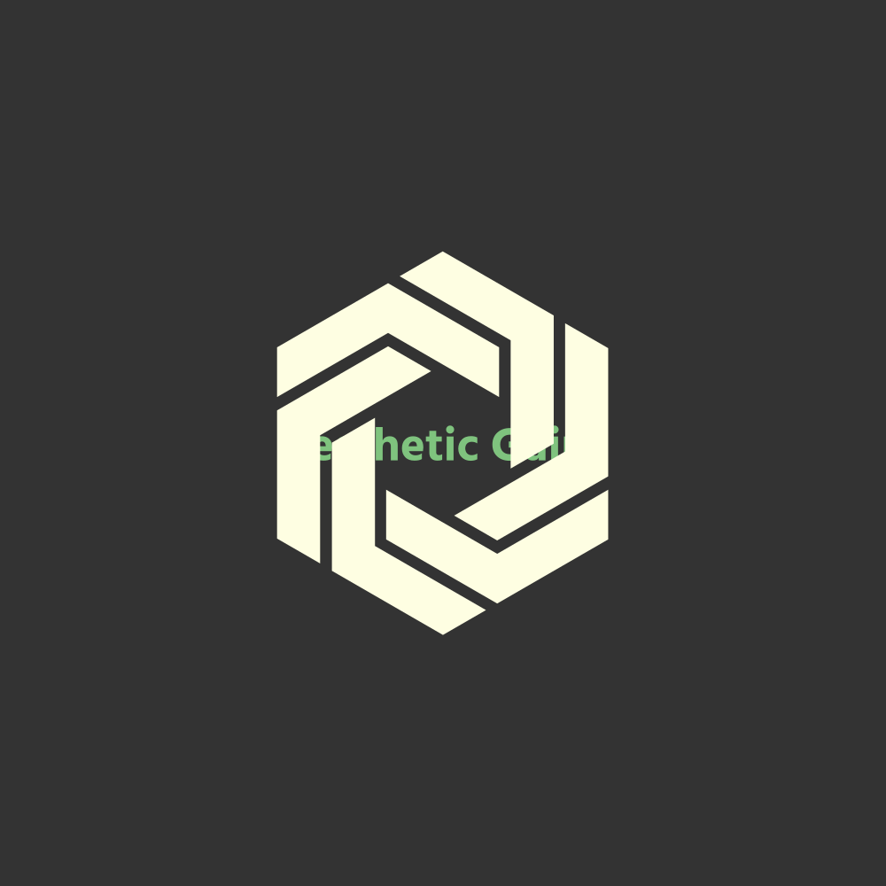
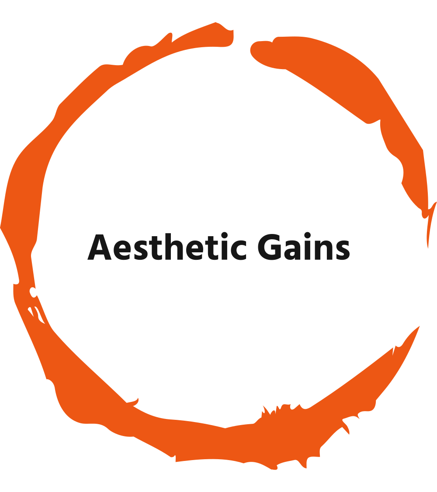
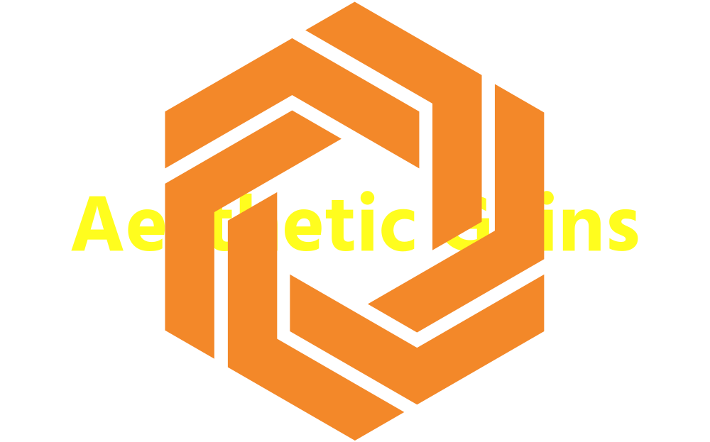
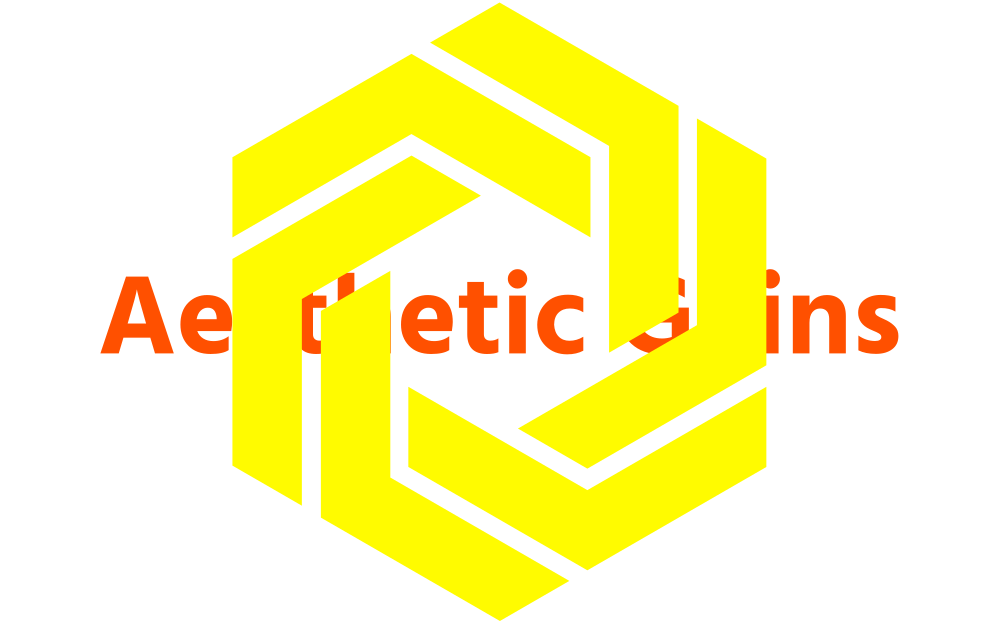

# aesthetic-gains

<!-- PROJECT LOGO -->
<br />
<div align="center">
  <a href="https://github.com/WackyChomp/aesthetic-gains">
    
    
    
    
  </a>

  <h3 align="center">Aesthetic Gains</h3>

  <p align="center">
    Learn about specific exercises and watch demos through YouTube
    <br />
    <a href="https://github.com/WackyChomp/aesthetic-gains"><strong>Explore the docs »</strong></a>
    <br /><br />
    ·
    <a href="https://github.com/WackyChomp/aesthetic-gains/issues">Request Feature</a>
    ·
    <a href="https://github.com/WackyChomp/aesthetic-gains/issues">Report Bug</a>
    ·
  </p>
</div>


<!-- TABLE OF CONTENTS -->
<details>
  <summary>Table of Contents</summary>
  <ol>
    <li>
      <a href="#about-the-project">About The Project</a>
      <ul>
        <li><a href="#built-with">Built With</a></li>
      </ul>
    </li>
    <li>
      <a href="#getting-started">Getting Started</a>
      <ul>
        <li><a href="#prerequisites">Prerequisites</a></li>
        <li><a href="#installation">Installation</a></li>
      </ul>
    </li>
    <li><a href="#usage">Usage</a></li>
    <li><a href="#roadmap">Roadmap</a></li>
    <li><a href="#contributing">Contributing</a></li>
    <li><a href="#contact">Contact</a></li>
    <li><a href="#acknowledgments">Acknowledgments</a></li>
  </ol>
</details>


<!-- ABOUT THE PROJECT -->
## About The Project

<!-- WIP images -->
![Product Name Screen Shot 1][Hero-Banner]
![Product Name Screen Shot 2][homepage]

When it comes to body fitness, there's a broad spectrum ranging from beginners to seasoned people. With the power of the internet, we open the floodgates to information and it can be overwhelming at times.

This app provides direct access to quick and correct information needed to identify the proper exercises for your fitness goals.

Here's Why:
* Brief synopsis of exercise along with video demonstrations to execute safely
* Exercisedb API offers the latest and up-to-date exercise information.
* Using a search engine can be cumbersome given the vast information presented to us. Avoid paralysis by analysis and resume workout


<p align="right">(<a href="#readme-top">back to top</a>)</p>


### Built With

This section should list any major frameworks/libraries used to bootstrap your project. Leave any add-ons/plugins for the acknowledgements section. Here are a few examples.

* [![React][React.js]][React-url]
* [![Material-UI][Material-UI]][Material-UI-url]
* [![HTML][HTML]][HTML-url]
* [![CSS][CSS]][CSS-url]
* [![Netlify][Netlify]][Netlify-url]

<p align="right">(<a href="#readme-top">back to top</a>)</p>


<!-- GETTING STARTED -->
## Getting Started

This is an example of how you may give instructions on setting up your project locally.
To get a local copy up and running follow these simple example steps.

### Prerequisites

This is an example of how to list things you need to use the software and how to install them.
* npm
  ```sh
  npm install npm@latest -g
  ```

### Installation

_Below is an example of how you can instruct your audience on installing and setting up your app. This template doesn't rely on any external dependencies or services._

1. Get a free API Key at [https://example.com](https://example.com)
2. Clone the repo
   ```sh
   git clone https://github.com/your_username_/Project-Name.git
   ```
3. Install NPM packages
   ```sh
   npm install
   ```
4. Enter your API in `config.js`
   ```js
   const API_KEY = 'ENTER YOUR API';
   ```

<p align="right">(<a href="#readme-top">back to top</a>)</p>


<!-- USAGE EXAMPLES -->
## Usage

Use this space to show useful examples of how a project can be used. Additional screenshots, code examples and demos work well in this space. You may also link to more resources.

_For more examples, please refer to the [Documentation](https://example.com)_

<p align="right">(<a href="#readme-top">back to top</a>)</p>


<!-- ROADMAP -->
## Roadmap
<h5>To Do List</h5>

- [x] Establish clear file structure
- [ ] Finalize logo design
- [ ] Finalize color themes
- [x] Connect to exercisedb API
- [x] Connect to YouTube API
- [ ] Adding comments to identify what each component does
- [ ]

<h5>Bonus</h5>

- [ ] Multi-language Support
    - [ ] ???
- [ ] Bookmark exercises ???

See [open issues](https://github.com/WackyChomp/aesthetic-gains/issues) for a full list of proposed features and known issues.

<p align="right">(<a href="#readme-top">back to top</a>)</p>


<!-- CONTRIBUTING -->
## Contributing

One aspect of open source that makes it appealing is how anyone can put forward contributions towards the project. It fosters a learning environment, allows for collaboration, and provides inspiration! 

Any ideas and suggestions that would help improve: fork the repo and create a pull request. You can also simply open an issue with the tag "enhancement". <br><br>Steps below:

1. Fork the Project
2. Create your Feature Branch (`git checkout -b feature/AmazingFeature`)
3. Commit your Changes (`git commit -m 'Add some AmazingFeature'`)
4. Push to the Branch (`git push origin feature/AmazingFeature`)
5. Open a Pull Request

<p align="right">(<a href="#readme-top">back to top</a>)</p>


<!-- ACKNOWLEDGMENTS -->
## Acknowledgments

Use this space to list resources you find helpful and would like to give credit to. I've included a few of my favorites to kick things off!

* [Malven's Flexbox Cheatsheet](https://flexbox.malven.co/)
* [Malven's Grid Cheatsheet](https://grid.malven.co/)
* [Image Shield Badges](https://dev.to/envoy_/150-badges-for-github-pnk)
* [Font Awesome](https://fontawesome.com)
* [GitHub Emoji Cheat Sheet](https://github.com/ikatyang/emoji-cheat-sheet)
* [Icons8 (free icons)](https://icons8.com/)
* [React Icons](https://react-icons.github.io/react-icons/search)
<!-- * []() -->

<p align="right">(<a href="#readme-top">back to top</a>)</p>


<!-- MARKDOWN LINKS & IMAGES -->
<!-- 
https://www.markdownguide.org/basic-syntax/#reference-style-links 

-->

<!--
[contributors-shield]: https://img.shields.io/github/contributors/WackyChomp/aesthetic-gains.svg?style=for-the-badge
[contributors-url]: https://github.com/WackyChomp/aesthetic-gains/graphs/contributors
[![contributors][contributors-shield]][contributors-url]
-->

<!--
[forks-shield]: https://img.shields.io/github/forks/WackyChomp/aesthetic-gains.svg?style=for-the-badge
[forks-url]: https://github.com/WackyChomp/aesthetic-gains/network/members
[![forks][forks-shield]][forks-url]
-->

<!--
[stars-shield]: https://img.shields.io/github/stars/WackyChomp/aesthetic-gains.svg?style=for-the-badge
[stars-url]: https://github.com/WackyChomp/aesthetic-gains/stargazers
[![Stars][stars-shield]][stars-url]
-->

<!--
[issues-shield]: https://img.shields.io/github/issues/WackyChomp/aesthetic-gains.svg?style=for-the-badge
[issues-url]: https://github.com/WackyChomp/aesthetic-gains/issues
[![Issues][issues-shield]][issues-url]
-->

<!--
[linkedin-shield]: https://img.shields.io/badge/-LinkedIn-black.svg?style=for-the-badge&logo=linkedin&colorB=555
[linkedin-url]:    URL-HERE
[![LinkedIn][linkedin-shield]][linkedin-url]
-->

[Hero-Banner]: ./src\assets\img\banner-image.png
[Homepage]: ./src\assets\img\homepage.png

[Next.js]: https://img.shields.io/badge/next.js-000000?style=for-the-badge&logo=nextdotjs&logoColor=white
[Next-url]: https://nextjs.org/

[React.js]: https://img.shields.io/badge/React-20232A?style=for-the-badge&logo=react&logoColor=61DAFB
[React-url]: https://reactjs.org/

[Bootstrap.com]: https://img.shields.io/badge/Bootstrap-563D7C?style=for-the-badge&logo=bootstrap&logoColor=white
[Bootstrap-url]: https://getbootstrap.com

[JQuery.com]: https://img.shields.io/badge/jQuery-0769AD?style=for-the-badge&logo=jquery&logoColor=white
[JQuery-url]: https://jquery.com 

[Material-UI]: https://img.shields.io/badge/Material--UI-0081CB?style=for-the-badge&logo=material-ui&logoColor=white
[Material-UI-url]: https://mui.com/


[Netlify]: https://img.shields.io/badge/Netlify-00C7B7?style=for-the-badge&logo=netlify&logoColor=white
[Netlify-url]: https://www.netlify.com/

[HTML]: https://img.shields.io/badge/HTML5-E34F26?style=for-the-badge&logo=html5&logoColor=white
[HTML-url]: https://en.wikipedia.org/wiki/HTML

[CSS]: https://img.shields.io/badge/CSS3-1572B6?style=for-the-badge&logo=css3&logoColor=white
[CSS-url]: https://en.wikipedia.org/wiki/CSS